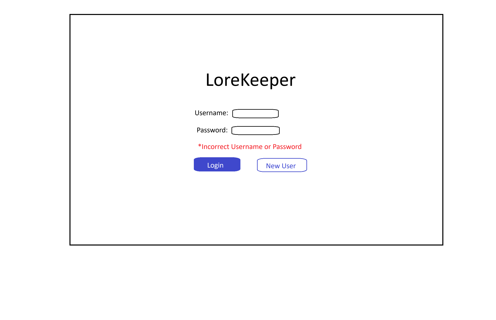
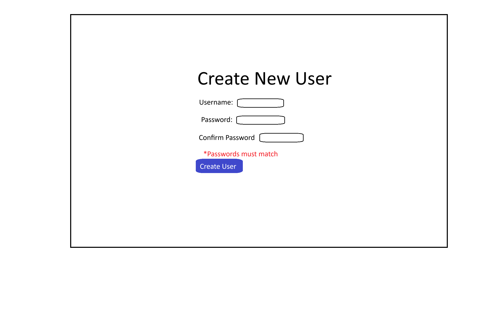
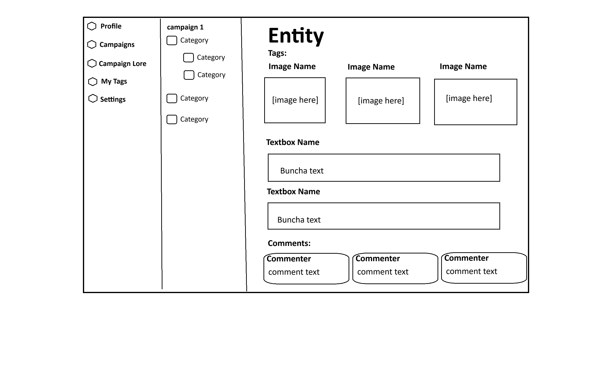

# Lorekeeper

Lorekeeper is a collaborative tabletop campaign lore manager. Game masters organize campaign
knowledge into categories and entities, attach textboxes and private images, tag related lore, and
reveal selected content to players. Players see only lore revealed to them, can follow links between
visible entities, comment on entries, and receive realtime notifications when new lore becomes
available.

The application includes:

- Account signup, login, password recovery, and signed session cookies
- GM-owned campaigns with player invitations and optional email notices
- Nested lore categories and campaign entities
- Named textboxes and private image uploads
- Per-player and reveal-to-all lore visibility
- Realtime campaign invitation and lore-reveal notifications
- Entity tags, comments, and automatic links between named entities
- Per-entity player co-owners with GM-scoped assignment and optional email notices
- Six accessible account-level color themes
- Responsive layouts for desktop and mobile screens

Production deployment: [lorekeeper-pied.vercel.app](https://lorekeeper-pied.vercel.app)

## Technology overview

- Next.js 16 App Router and React 19
- TypeScript
- Supabase Auth, Postgres, Storage, and Realtime
- Tailwind CSS/PostCSS plus application CSS
- Vitest and Testing Library

The application uses Server Components by default, Server Actions for mutations, and client
components only where browser state or realtime subscriptions are required. Server-side database
access uses the Supabase secret/service-role key; that key must never be exposed to browser code.

## Run the app in another developer workspace

### Prerequisites

- Node.js 20.9 or newer
- npm
- Git
- A Supabase project for development
- Access to that project's URL, publishable key, and secret/service-role key

The repository does not include `supabase/config.toml`, so it does not automatically start a local
Supabase stack. The normal development workflow connects the app to a hosted Supabase project.

### 1. Clone and install

```bash
git clone <repository-url>
cd lorekeeper
npm ci
```

Use `npm ci` rather than `npm install` for initial setup so the versions in `package-lock.json` are
installed exactly.

### 2. Prepare a development Supabase project

Use a separate development project rather than production. The SQL files in
`supabase/migrations/` are the database source of truth. They create the schema, row-level security,
database functions, private `entity-images` Storage bucket, realtime notification policies and
triggers, and the starter data created for new campaigns.

The Supabase CLI is not a project dependency. You can run it temporarily through `npx`:

```bash
npx supabase init
npx supabase login
npx supabase link --project-ref <your-project-ref>
npx supabase db push
```

Run these commands from the repository root. `supabase init` creates the local CLI configuration
for that workspace; `db push` applies the checked-in migrations to the linked project.

If your team gives you an existing development project whose migrations are already current, link
to it but do not reset it. Confirm with the project owner before running database reset or destructive
commands.

### 3. Configure environment variables

Copy the example file:

```bash
# macOS or Linux
cp .env.example .env.local
```

```powershell
# Windows PowerShell
Copy-Item .env.example .env.local
```

Fill in `.env.local`:

```dotenv
SUPABASE_URL=https://your-project-ref.supabase.co
SUPABASE_SECRET_KEY=your-server-secret-or-service-role-key
SUPABASE_PUBLISHABLE_KEY=your-publishable-or-anon-key
SESSION_SECRET=replace-with-at-least-32-random-characters
NEXT_PUBLIC_APP_URL=http://localhost:3000
RESEND_API_KEY=re_replace-with-your-resend-api-key
NOTIFICATION_EMAIL_FROM=Lorekeeper <notifications@example.com>
```

Where the values come from:

- `SUPABASE_URL`: the development project's API URL.
- `SUPABASE_SECRET_KEY`: the secret or legacy service-role key. This is server-only and bypasses
  row-level security for trusted application operations. Never prefix it with `NEXT_PUBLIC_`, commit
  it, log it, or send it to the browser.
- `SUPABASE_PUBLISHABLE_KEY`: the publishable or legacy anon key used for user authentication and
  the authenticated Realtime client.
- `SESSION_SECRET`: a random value of at least 32 characters used to sign Lorekeeper's session JWT.
- `NEXT_PUBLIC_APP_URL`: the canonical application origin used in password recovery and notification links.
- `RESEND_API_KEY` and `NOTIFICATION_EMAIL_FROM`: server-only notification email configuration.
  These are required only when a GM checks an email-notification option. Supabase Auth sends the
  separate password-recovery email through the project's configured Auth SMTP provider.

Add both the local and deployed `${NEXT_PUBLIC_APP_URL}/auth/reset-password` URLs to Supabase
Authentication's redirect URL allow list. Configure `NOTIFICATION_EMAIL_FROM` with a sender on a
domain verified by Resend; otherwise checked campaign/entity email notices will be rejected by the
email provider.

Generate a session secret with either:

```bash
openssl rand -base64 32
```

```powershell
[Convert]::ToBase64String(
  [Security.Cryptography.RandomNumberGenerator]::GetBytes(32)
)
```

The code also accepts the compatibility names `SUPABASE_SERVICE_ROLE_KEY`,
`NEXT_PUBLIC_SUPABASE_URL`, and `NEXT_PUBLIC_SUPABASE_PUBLISHABLE_KEY`/`NEXT_PUBLIC_SUPABASE_ANON_KEY`,
but the names in `.env.example` are preferred.

Restart the development server whenever environment variables change.

### 4. Start development

```bash
npm run dev
```

Open [http://localhost:3000](http://localhost:3000). Create at least two accounts if you want to
exercise both sides of the reveal workflow: one campaign GM and one invited player.

### 5. Verify the workspace

Before opening a pull request, run:

```bash
npm test
npm run test:backend-contract
npm run lint
npx tsc --noEmit
npm run build
```

The regular test suite does not require a live Supabase project. Database and Realtime boundaries
are mocked where necessary. `test:backend-contract` is the exception: it checks the configured
Supabase project for required RPC migrations without persisting data. Run it after database
migrations and before deploying application code.

## npm scripts

| Command | Purpose |
| --- | --- |
| `npm run dev` | Start the Next.js development server with hot reload. |
| `npm run build` | Create a production build. |
| `npm start` | Serve an existing production build. Run `npm run build` first. |
| `npm test` | Run the Vitest suite once. |
| `npm run test:backend-contract` | Verify that required campaign-creation RPCs are deployed to the configured Supabase project. |
| `npm run lint` | Run ESLint across the repository. |
| `npm run format` | Format files under `app/` with Prettier. |

## Packages beyond Next.js

The following packages are not application features supplied by Next.js itself.

### Runtime dependencies

| Package | How Lorekeeper uses it |
| --- | --- |
| `@supabase/supabase-js` | Connects server code to Supabase Auth, Postgres RPCs, and private Storage. It also creates the authenticated browser Realtime subscription used for invitations and lore-reveal notifications. |
| `jose` | Signs and verifies Lorekeeper's HTTP-only session JWT cookies with `SESSION_SECRET`. Supabase access and refresh tokens are stored in separate HTTP-only cookies. |
| `zod` | Validates and normalizes authentication and profile form input before server actions use it. |
| `server-only` | Marks session and data-access modules as server-only so secrets and privileged Supabase operations cannot accidentally enter a client bundle. |

`react` and `react-dom` are declared explicitly because the app runs on React 19, but they are part
of the core Next.js application stack rather than Lorekeeper-specific integrations.

### Development and test dependencies

| Package | How Lorekeeper uses it |
| --- | --- |
| `vitest` | Runs unit, architecture, database-boundary, accessibility, responsive CSS, and frontend integration tests. |
| `@testing-library/react` | Mounts real React components and queries their accessible DOM output in frontend tests. |
| `jsdom` | Supplies a browser-like DOM for Testing Library without starting a browser or changing the database. |
| `typescript` | Performs static type checking for application and test code. |
| `eslint` and `eslint-config-next` | Enforce JavaScript, TypeScript, React, and Next.js correctness rules. |
| `prettier` | Applies consistent source formatting. |
| `tailwindcss` and `@tailwindcss/postcss` | Process the Tailwind import and CSS build pipeline used by `app/globals.css`. |
| `@types/node`, `@types/react`, and `@types/react-dom` | Provide TypeScript definitions for Node.js and React APIs. |

## Project structure

```text
app/
  api/                     Server route handlers, including Realtime token issuance
  auth/                    Login and signup routes/actions
  components/              Shared UI and form primitives
  data/                    Authenticated campaigns, lore, tags, profile, and settings UI
lib/
  session.ts               Signed application sessions and Supabase auth-token cookies
supabase/
  migrations/              Ordered database, Storage, security, and Realtime migrations
  seed.sql                 Reference seed data
__tests__/                 Unit and frontend integration tests
assets/                    Design wireframes
public/                    Public static assets
```

Important implementation details:

- `app/dataloader.js` is the server-only boundary for Supabase reads, RPCs, Auth, and Storage.
- `app/data/actions.ts` and route-specific action files contain Server Actions.
- Database functions enforce campaign access and GM/player permissions in addition to UI checks.
- Entity images live in a private Storage bucket and are rendered through temporary signed URLs.
- Realtime clients receive short-lived Supabase access tokens from `/api/realtime-token`; the server
  secret key is never returned.
- This project uses Next.js 16. Read the checked-in `AGENTS.md` and the relevant local documentation
  under `node_modules/next/dist/docs/` before changing Next.js APIs or conventions.

## Database model

At a high level:

- `profile` corresponds one-to-one with a Supabase Auth user and stores username, last campaign,
  and theme preferences. `profile_ai_api` stores encrypted, account-owned AI provider credentials.
- `campaign` belongs to one GM. `pending_campaign_invites` stores invitations awaiting a player's
  acceptance; accepted membership is stored in `campaign_player`.
- `category` belongs to a campaign and uses `parent_category_id` for nesting. `entity` belongs to a
  campaign and may belong to one category from that same campaign.
- `entity_co_owner` joins an entity to one or more accepted campaign players. Assignment is
  immediate and GM-controlled. Co-owners may rename—but not move or delete—the entity, and may add,
  edit, delete, reveal, and unreveal its textboxes and images.
- `entity_textbox` and `entity_image` belong to an entity. Image rows store metadata and a private
  Supabase Storage path in the `entity-images` bucket.
- `textbox_revealed` and `image_revealed` join content to specific player profiles; a null
  `profile_id` means the content is revealed to every accepted campaign player.
- `tag` is account-owned and connects to entities through `entity_tag`.
- `comment` belongs to an entity and the profile that posted it.

The complete executable schema and its evolution live in `supabase/migrations/`; consult those files
instead of maintaining a separate hand-written schema diagram.

## Wireframes

### Login screen



### New user screen



### Lore screen


